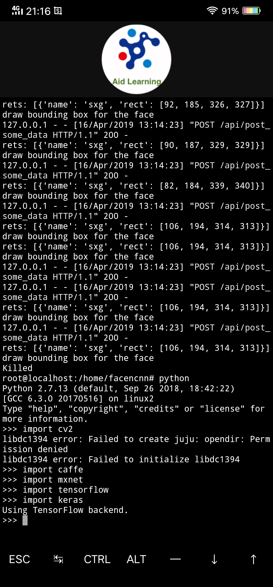
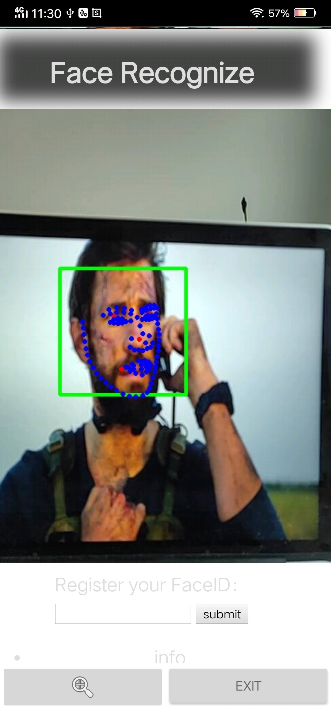

# AidLearning

 

Aidlearning is a Python programming framwork for mobile devices. In addition to some of the features available in the Linux environment, Aidlearning has supported GUI and neural network environments. For example, Caffe, Tensorflow, Mxnet, ncnn, Keras are perfectly supported.

Aidlearning是一个手机可用的Python编程框架。将Linux系统移植到手机上，开发者可以高效、方便地进行Python编程。除了一些Linux环境下可用的功能，Aidlearning还加入了GUI和神经网络环境，现阶段已经完美支持Caffe, Tensorflow, Mxnet, ncnn, Keras

---

### Support most common deep learning frameworks
### 支持大部分常用的深度学习框架

	

* [Caffe](https://github.com/BVLC/caffe)
* [Tensorflow](https://github.com/tensorflow/tensorflow)
* [Mxnet](https://github.com/apache/incubator-mxnet)
* [Keras](https://github.com/keras-team/keras)
* [ncnn](https://github.com/Tencent/ncnn)

---

### Instructions
### 使用方法

You just need download the aidlux.apk, and install it, it only 7M size.
* http://www.aidlearning.net/downloads/aidlux-05-10.apk

---

### Graphical User Interface
### GUI集成

We fixed Graphical User Interface for the Linux on Andorid(It has been pruned by andorid!), so you can display results and debug quickly. For instance, You can use opencv to open and view camera!

	

### Features
### 特点概述

* You can coding on your phone anywhere, anytime. Every inch of fragmentation have been fully utilized. Your creativity can be instantly realized with a flash of inspiration.
* PC is an alternative way to connect to Aidlearning, you can open the url:mobilephone'sip:8900/ in the pc to Editing codes files(python files storing in the AidLearnig ) in the pc when the mobile phone and the pc in the same network group.

### Example

Face Landmark (106 keypoints ncnn) 15fps in mobile phone

Facencnn(mobiefacenet ncnn) 15fps in mobile phone

handpose (tensorflow ) 5fps in mobile phone

body posenet for single person(converted from google ) 10fps in mobile phone

body posenet for multi-person(converted from google ) 7fps in mobile phone

Stylized picture(GAN ) 3fps in mobile phone .....

# cap1
## cap2
### cap3

* aaa
** aaa
*** aaa
**aaa**
***aaa***