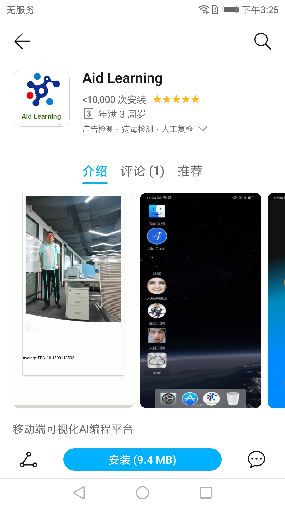
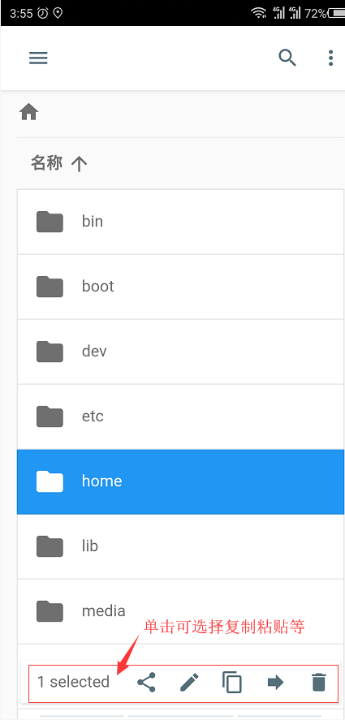
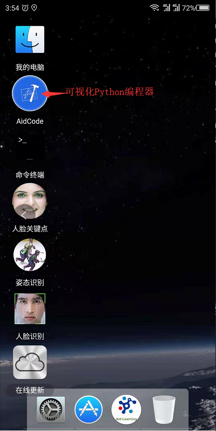
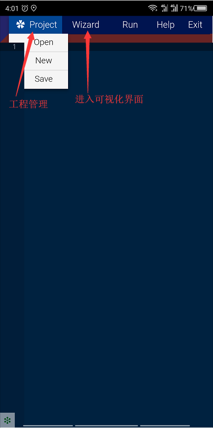
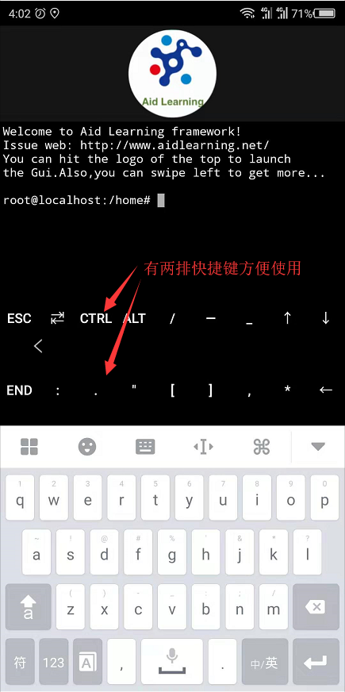
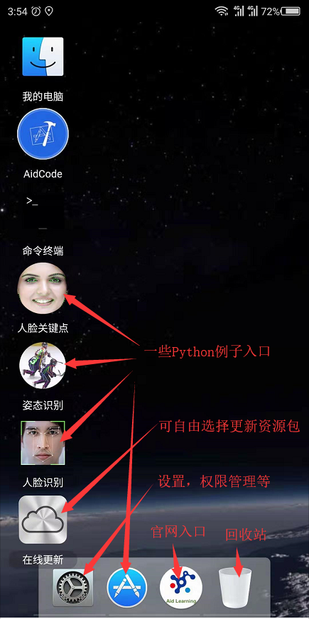
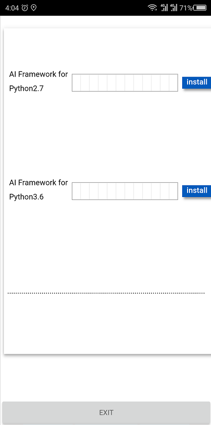
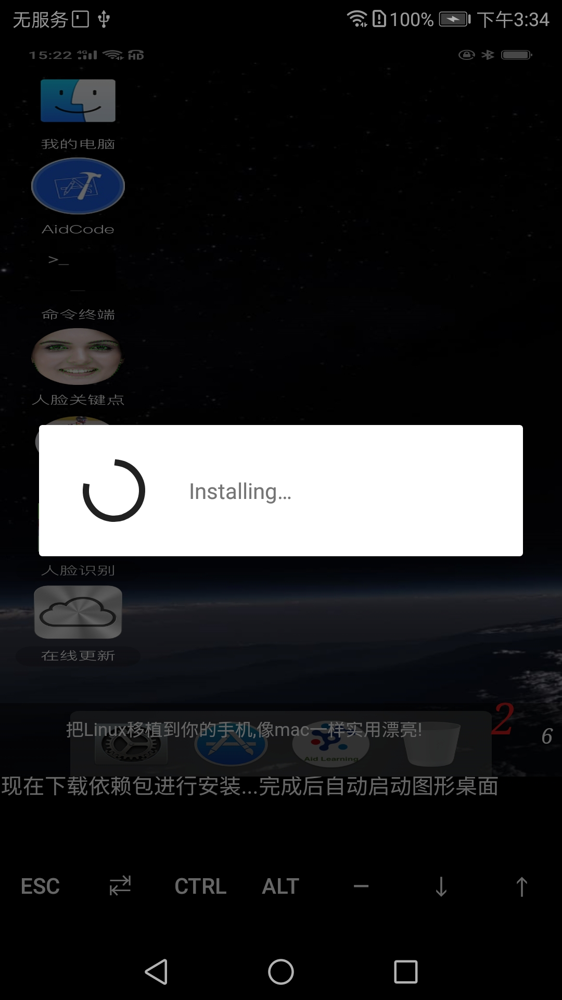
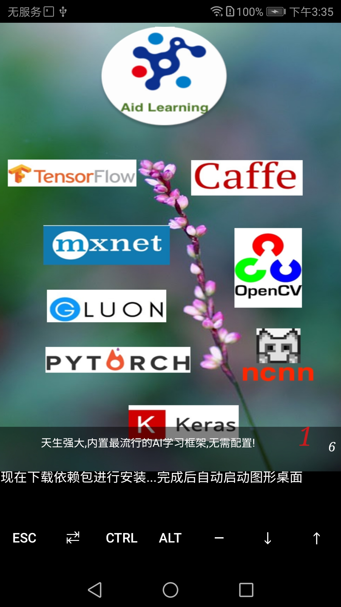
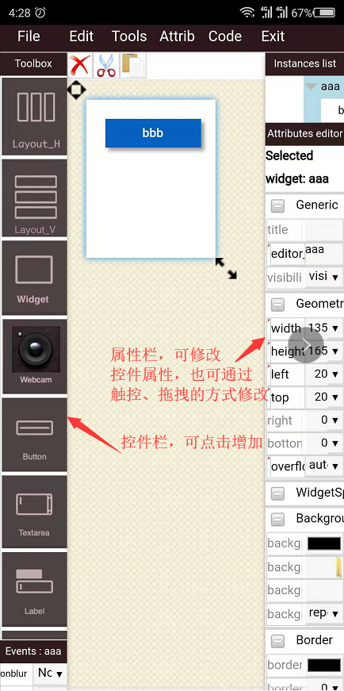

**使用说明**
<!-- ### 目录
- <a href='## 下载'>⚘ 下载</a>
- <a href='## 界面介绍'>⚘ 界面介绍</a>
- <a href='## 使用说明'>⚘ 使用说明</a> -->
@[TOC]目录

# 使用说明
## 下载
可以在各大手机应用市场或者Github上搜索AidLearning下载。

	

也可以去 [Github主页](https://github.com/aidlearning/AidLearning-FrameWork)或者[官网](http://www.aidlearning.net)进行下载
## 界面介绍
### 我的电脑

	

### AidCode

	

### 终端

	

### 其他
下图右边为更新界面，可以自定义资源包，减少下载时间，后续会有更详细的资源包列表。

	

## 使用说明
### 下载安装
第一次运行程序，会自动下载配置基本资源包

	

### AidCode介绍

	

### 电脑通过ssh连接
首先需要在PC端安装ssh，然后执行**ssh-keygen**生成密钥文件